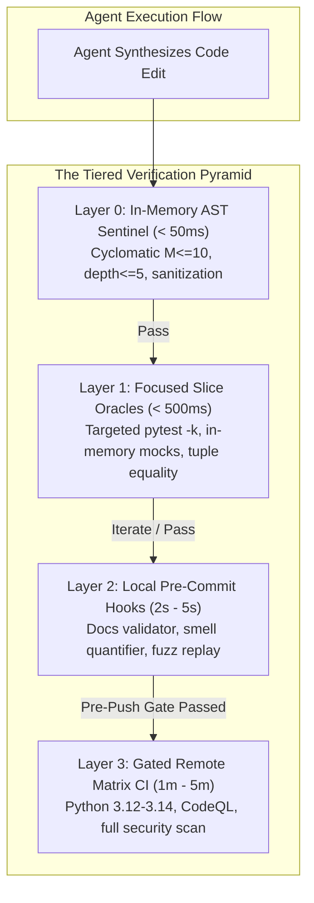

# Pattern: Tiered Verification Pyramid & Sub-Second Oracles

> **Pattern Class**: Verification Architecture / Agent Lifecycle Governance  
> **Problem**: Monolithic test runs in expanding codebases stall autonomous agents with high latency ($> 30\text{s}$), triggering context decay, tool execution timeouts, and oscillatory repair death spirals.  
> **Solution**: Implement a 4-tier verification hierarchy separating instant mechanical AST sentinels (<50ms) and focused slice assertions (<500ms) from local pre-commit hooks (<5s) and remote gated CI, paired with structural tuple equality assertions.  
> **TLDR**: Shield autonomous agents from slow test suites by providing layered, sub-second mechanical oracles that return precise counterexamples.  
> **ELI:7b**: Don't make the AI wait for the entire school exam every time it fixes a typo; give it a 1-second flashcard check for fast progress.  

---

## 1. Context & Forces

As software projects grow in scale and maturity, their verification machinery accumulates complexity. What begins as a 200ms test suite grows to include end-to-end integration tests, containerized databases, schema validators, code coverage instrumentation, and multi-language linters. In a mature repository, running the complete test suite often takes between 45 seconds and 3 minutes.

For human developers, this latency is easily tolerated. But for autonomous AI coding agents operating in an agentic loop, **long validation latency is an existential barrier to convergence**:

1. **The Cognitive Decay Trap**:
   During long test runs, the agent's context window is flooded with polling status checks, command outputs, and framework tracebacks. This causes attention dilution ($ADI$), where early system instructions and negative constraints are forgotten.
2. **The Tool Execution Timeout**:
   Agent environments enforce strict timeouts on tool executions (typically 30 seconds). Monolithic test runs exceed this threshold, forcing commands into asynchronous background tasks that disrupt conversational focus.
3. **The Assertion Density Penalty**:
   When tests assert multiple properties sequentially, Python AST semantics compile each `assert` to an `if not (expr): raise AssertionError` branch. Ten linear assertions add $+10$ to the test function's McCabe cyclomatic complexity ($M$), causing the test suite itself to breach architectural complexity caps ($M \le 10$).

---

## 2. Architectural Solution

The **Tiered Verification Pyramid** decouples test suite depth from agent iteration speed by organizing validation into four strictly bounded feedback tiers:



### Layer Breakdown

| Layer | Target Latency | Execution Scope | Trigger Event | Primary Failure Mode Addressed |
| :--- | :--- | :--- | :--- | :--- |
| **Layer 0: AST Sentinel** | $\le 50\text{ms}$ | In-memory AST analysis of touched files | Immediate post-write hook | Catches monster functions ($M > 10$), nesting ($> 5$), and secret leaks instantly. |
| **Layer 1: Focused Slice Oracle** | $\le 500\text{ms}$ | Single active test module or function | Agent inner edit loop | Validates functional correctness with zero subprocess or plugin overhead. |
| **Layer 2: Local Pre-Commit** | $\le 5.0\text{s}$ | Staged files & lightweight cross-checks | Git commit boundary | Validates documentation link integrity, code smell scores, and fuzz regressions. |
| **Layer 3: Gated Remote CI** | $1\text{m} - 5\text{m}$ | Full repository matrix & integration tests | Pull request & push boundary | Enforces multi-runtime conformance, supply chain security, and branch protection. |

---

## 3. Structural Tuple Consolidation in Test Suites

To prevent comprehensive tests from breaching McCabe complexity ceilings ($M \le 10$), assertions must be consolidated into structural tuple equality checks or collection predicates.

### Anti-Pattern: Linear Assertion Sprawl
```python
# FLAWED: Compiles to 6 branch points in AST (McCabe M = 7)
def test_create_user(client):
    user = client.create_user("alice", "alice@example.com")
    assert user.id is not None
    assert user.username == "alice"
    assert user.email == "alice@example.com"
    assert user.role == "developer"
    assert user.is_active is True
    assert user.tier == "standard"
```

### Pattern: Consolidated Structural Tuple Equality
```python
# CORRECT: Compiles to a single AST comparison (McCabe M = 1)
def test_create_user(client):
    user = client.create_user("alice", "alice@example.com")
    assert (
        user.id is not None,
        user.username,
        user.email,
        user.role,
        user.is_active,
        user.tier,
    ) == (
        True,
        "alice",
        "alice@example.com",
        "developer",
        True,
        "standard",
    )
```

**Diagnostic Preservation**: When a consolidated tuple check fails under Pytest, the diff output preserves exact element-level diagnostic reporting:
```text
AssertionError: assert (True, 'alice', 'alice@example.com', 'developer', False, 'standard') == (True, 'alice', 'alice@example.com', 'developer', True, 'standard')
  At index 4 diff: False != True
```

---

## 4. Counterexample-Guided Synthesis (CEGIS) Protocol

When Layer 1 or Layer 2 oracles fail, error reporting must be formatted as structured, deterministic counterexamples rather than conversational prose:

```python
# Example: CEGIS Error Representation for AI Agents
{
    "status": "FAILED",
    "oracle": "Layer 1: Unit Slice",
    "target_file": "src/tax_engine.py",
    "line": 42,
    "input_tuple": ("CO", 100.0),
    "expected_value": 102.90,
    "actual_value": 100.00,
    "invariant_violated": "TAX001: Missing state sales tax multiplier"
}
```

By presenting the failure as an algebraic counterexample, the agent's neural search space is immediately constrained to modifying line 42, enabling single-turn repair convergence.

---

## 5. Verification & Invariants

This pattern establishes three non-negotiable operational invariants:

1. **Inner-Loop Latency Cap**: The inner verification cycle ($L_0 + L_1$) must complete in under $1.0\text{s}$. If a unit test requires external database spin-up or network calls, it must be migrated to Layer 2 or Layer 3.
2. **Assertion Complexity Ceilings**: Test functions are subject to the same $M \le 10$ and depth $\le 5$ ceilings as application code.
3. **Pre-Push Quality Gate Mandate**: Layer 3 remote CI must be mirrored locally via a single unified command (`uv run devops ci`), which must pass 100% before any commit is pushed.
