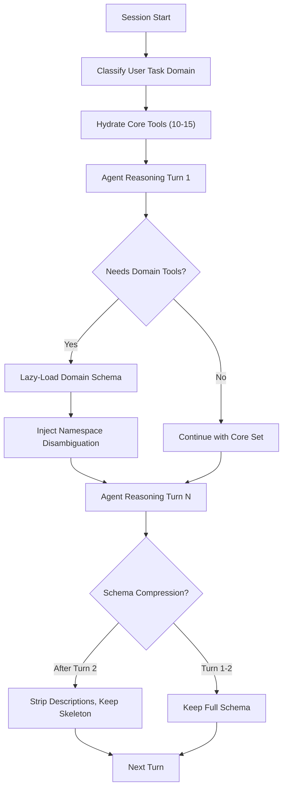

# Tool Cardinality Budget Management

## 1. Problem Statement

As autonomous agent toolsets grow beyond ~40 tools, models exhibit **selection precision collapse** — vacillating between semantically adjacent tools, hallucinating parameter names from pretraining priors, and consuming 15-25% of the context window with schema definitions before any task reasoning begins. The tool surface is unbounded while the attention budget is fixed.

## 2. Core Mechanics



### Three Operational Tiers

**Tier 1 — Eager Core Set (~15 tools, ~1,200 tokens)**:
High-frequency, domain-agnostic tools loaded at session start. Examples: `view_file`, `grep_search`, `run_command`, `write_to_file`, `replace_file_content`, `find_by_name`, `list_dir`. These are the tools every task needs regardless of domain.

**Tier 2 — Lazy Domain Sets (~10-20 tools per domain, loaded on demand)**:
Domain-specific tools hydrated when the agent's reasoning trajectory enters a namespace. When the agent mentions "kubernetes" or "pods," hydrate the `k8s_*` tool set. When it mentions "security scan," hydrate `scan_*`. The MCP protocol's lazy tool discovery mechanism supports this natively.

**Tier 3 — Schema Compression (after first exposure)**:
After the model has seen a tool's full schema (name + description + parameters + examples) in turns 1-2, subsequent turns receive only the structural skeleton (name + parameter types + required flags). This reduces per-tool token cost from ~80 to ~30 tokens.

### Namespace Disambiguation Preamble

For tool families sharing a prefix, inject a dense discriminative signal:

```
Tool disambiguation:
- scan_trivy: Container/OS CVE vulnerabilities
- scan_semgrep: Static application security testing (SAST) code patterns
- scan_gitleaks: Leaked secrets and credentials in git history
- scan_checkov: Infrastructure-as-Code policy violations
- scan_complexity: McCabe cyclomatic complexity and nesting depth
```

Cost: ~10 tokens per tool. Benefit: eliminates the vacillation failure mode where the model oscillates between `scan_trivy` and `scan_semgrep` for 3 turns before committing.

## 3. Implementation Example

```python
from typing import Final

# Tier 1: Always-loaded core tools
CORE_TOOL_NAMES: Final[frozenset[str]] = frozenset({
    "view_file", "grep_search", "find_by_name", "list_dir",
    "run_command", "write_to_file", "replace_file_content",
})

# Tier 2: Domain-specific lazy sets
DOMAIN_TOOL_SETS: Final[dict[str, frozenset[str]]] = {
    "kubernetes": frozenset({"k8s_pods", "k8s_status", "k8s_logs_query", "k8s_deploy_stack"}),
    "security": frozenset({"scan_trivy", "scan_semgrep", "scan_gitleaks", "scan_checkov"}),
    "github": frozenset({"gh_issue_list", "gh_issue_create", "pr_list", "pr_diff"}),
    "infrastructure": frozenset({"tf_plan", "tf_apply", "tf_output", "tf_cost_estimate"}),
}

# Domain detection keywords (closed, exhaustive per AGENTS.md §1)
DOMAIN_KEYWORDS: Final[dict[str, frozenset[str]]] = {
    "kubernetes": frozenset({"pod", "k8s", "kubectl", "namespace", "deployment", "helm"}),
    "security": frozenset({"scan", "vulnerability", "cve", "secret", "audit", "compliance"}),
    "github": frozenset({"issue", "pr", "pull request", "milestone", "label", "project"}),
    "infrastructure": frozenset({"terraform", "tofu", "plan", "apply", "infrastructure"}),
}


def detect_domains(user_message: str) -> list[str]:
    """Detect which tool domains are relevant to the user's message."""
    lower = user_message.lower()
    return [
        domain
        for domain, keywords in DOMAIN_KEYWORDS.items()
        if any(kw in lower for kw in keywords)
    ]
```

## 4. Guardrails & Anti-Patterns

| Anti-Pattern | Why It Fails | Correct Alternative |
|---|---|---|
| Load all 100+ tools eagerly | 25% context window consumed by schemas alone | Lazy domain hydration on demand |
| Rely on tool descriptions alone for disambiguation | Descriptions are structurally similar across same-prefix tools | Inject explicit disambiguation preamble |
| Keep full schemas in every turn | Redundant token cost after first exposure | Compress to skeleton after turn 2 |
| Hardcode domain detection with unbounded keyword lists | Violates `AGENTS.md §1` (brittle partial subset matching) | Use closed, auditable keyword sets declared in constants |
| Remove tools mid-conversation | Model loses track of previously available capabilities | Never remove, only compress |

## 5. Cross-References

- **Observation**: [18 — Tool Cardinality Saturation & Schema Context Taxation](../observations/devops-cli/18-tool-cardinality-saturation-and-schema-context-taxation.md)
- **Observation**: [10 — Negative Tool Contract Assertions & Prescriptive Prompt Synthesis](../observations/devops-cli/10-negative-tool-contract-assertions-and-prescriptive-prompt-synthesis.md)
- **Pattern**: [epistemic-hygiene-and-context-pruning](./epistemic-hygiene-and-context-pruning.md)
- **Observation**: [19 — Context Accumulation Drift & Lossy Reflection Truncation](../observations/devops-cli/19-context-accumulation-drift-and-lossy-reflection-truncation.md)
