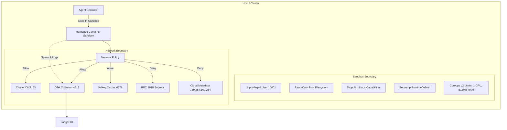

# Pattern: Zero-Trust Sandboxing & Distributed Observability

> **Pattern Class**: Runtime Isolation & Distributed Observability
> **Problem**: Agents synthesize and execute untrusted code, and raw execution privileges expose the host and the network behind it
> **Solution**: Rootless, capability-dropped sandboxes paired with high-fidelity telemetry, so isolation is verifiable rather than assumed
> **Reference Implementation**: [`examples/ephemeral-container-sandbox/`](../examples/ephemeral-container-sandbox/)

A defense-in-depth architectural pattern coupling isolated, unprivileged execution environments with continuous, high-fidelity distributed telemetry.

---

## 1. Problem Statement

Autonomous coding agents routinely synthesize, compile, and execute untrusted code (scripts, tests, database queries, network requests). Granting agents raw execution privileges on developer host machines or production clusters exposes systems to severe vulnerabilities:
- **Server-Side Request Forgery (SSRF)**: Inadvertent crawling or scanning of internal RFC 1918 subnets, cloud metadata APIs (`169.254.169.254`), or private databases.
- **Resource Starvation / Fork Bombs**: Runaway loops or deeply recursive subagent subprocesses exhausting CPU, memory, and process table slots.
- **Blind Execution**: Running code without real-time observability makes it impossible to distinguish between a hang, an infinite loop, or a long-running test suite.

---

## 2. Core Mechanics

The pattern combines **Container Sandboxing Invariants** with an **OpenTelemetry Telemetry Mesh**:



### Three Pillars of Isolation:

1. **Unprivileged Process Isolation**:
   - `runAsNonRoot: true` with non-zero UID/GID (`10001`).
   - Root filesystem is mounted read-only (`readOnlyRootFilesystem: true`); temporary scratch space is mounted on size-bounded `tmpfs` or `emptyDir` volumes.
   - All kernel capabilities are dropped (`drop: ["ALL"]`), preventing raw network socket forging or privilege escalation.
2. **Egress Firewalling & SSRF Prevention**:
   - Outbound network traffic is filtered at the kernel/CNI layer via Kubernetes `NetworkPolicy` or Docker network bridges.
   - External internet egress is allowed only if explicitly needed, while all private RFC 1918 ranges (`10.0.0.0/8`, `172.16.0.0/12`, `192.168.0.0/16`) and cloud metadata endpoints (`169.254.169.254`) are dropped unconditionally.
3. **Telemetry Streaming**:
   - Execution commands within the sandbox stream child spans and standard streams to the local OTel Collector over in-cluster endpoints.
   - If execution times out or triggers an egress block, an alert fires instantly with the associated trace ID.

---

## 3. Implementation Blueprint

### Docker Sandbox Definition:
```yaml
agent-sandbox:
  image: python:3.14-slim
  user: "10001:10001"
  read_only: true
  tmpfs:
    - /tmp:size=64M,mode=1777
    - /workspace:size=256M,mode=0755
  deploy:
    resources:
      limits:
        cpus: "1.0"
        memory: 512M
```

### Trace Injection Wrapper:
```python
import os
import subprocess
import time

def run_in_sandbox(command: list[str], traceparent: str, timeout_seconds: int = 30) -> subprocess.CompletedProcess:
    """Execute command inside sandbox container with W3C trace context."""
    env = os.environ.copy()
    env["TRACEPARENT"] = traceparent
    env["PYTHONUNBUFFERED"] = "1"
    
    return subprocess.run(
        ["docker", "exec", "-e", f"TRACEPARENT={traceparent}", "vibes-agent-sandbox", *command],
        capture_output=True,
        text=True,
        timeout=timeout_seconds,
        check=False
    )
```

---

## 4. Key Takeaways

1. **Sandboxing is Not Optional**: Never allow an autonomous LLM to execute synthesized code directly on host developer machines.
2. **Egress is the Weakest Link**: Most sandboxes secure the filesystem but leave outbound networking open. Enforcing CIDR blocklists prevents SSRF and secret exfiltration.
3. **Observability Completes the Loop**: Sandboxes without distributed tracing turn timeouts into debugging nightmares. Spans provide immediate visibility into command hangs and resource thrashing.
