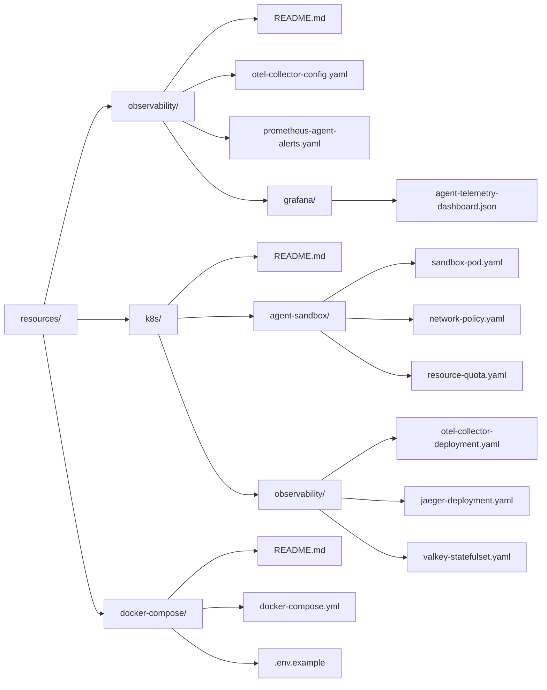

# Infrastructure & Observability Resources

This directory contains production-grade infrastructure manifests, observability configurations, and container topologies designed specifically for orchestrating, isolating, and monitoring autonomous AI coding agents.

---

## Directory Organization

---

## Key Engineering Invariants Enforced

1. **Zero-Trust Egress Sanitization**:
   - Manifests strictly reject internal RFC 1918 addresses (`10.0.0.0/8`, `172.16.0.0/12`, `192.168.0.0/16`) and cloud metadata (`169.254.169.254/32`).
   - Mock endpoints standardize strictly on `example.com` without subdomains.
2. **Hardened Runtime Sandboxing**:
   - Container processes run as non-root (`10001`), with read-only root filesystems and all Linux capabilities dropped (`drop: ["ALL"]`).
   - Hard cgroups v2 caps on CPU and memory prevent fork bombs and runaway subprocesses.
3. **Continuous Agent Telemetry**:
   - W3C distributed trace context propagation across multi-tier subagents.
   - Real-time token spend tracking, P50/P90/P99 tool latency measurement, and AST invariant gate auditing.
