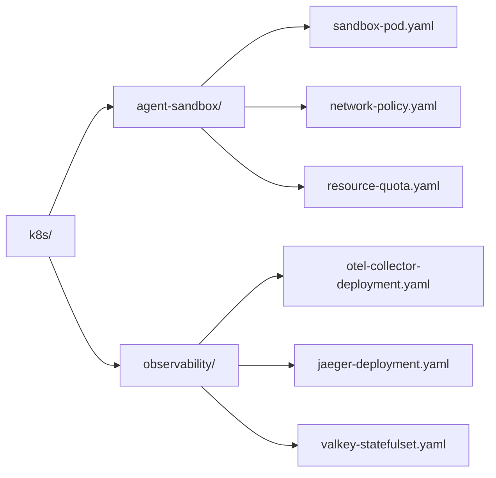

# Kubernetes Manifests for Hardened Agent Sandboxes & Observability

Production-grade Kubernetes manifests designed for isolated multi-agent execution, zero-trust network policies, and in-cluster telemetry collection.

---

## Directory Structure



---

## Security Invariants Enforced

1. **Pod Security Standard (`Restricted`)**:
   - `runAsNonRoot: true` with non-zero UID/GID (`10001`).
   - `readOnlyRootFilesystem: true` with ephemeral, size-bounded `emptyDir` scratch volumes.
   - `capabilities.drop: ["ALL"]` preventing raw socket creation and privilege escalation.
   - `seccompProfile.type: RuntimeDefault` filtering dangerous system calls.
2. **SSRF & Network Egress Mitigation (`NetworkPolicy`)**:
   - Denies all inbound traffic to sandbox pods.
   - Restricts egress to cluster DNS (`kube-dns:53`), in-cluster Valkey (`:6379`), and in-cluster OTel Collector (`:4317`/`:4318`).
   - External egress strictly filters out private RFC 1918 CIDRs (`10.0.0.0/8`, `172.16.0.0/12`, `192.168.0.0/16`) and cloud metadata (`169.254.169.254/32`).
3. **Resource Starvation Protection (`ResourceQuota` & `LimitRange`)**:
   - Prevents recursive subagent fork bombs or runaway memory consumption from destabilizing cluster nodes.

---

## Deployment Instructions

### 1. Create Namespaces
```bash
kubectl create namespace agent-workloads
kubectl create namespace agent-observability
```

### 2. Apply Observability Stack
```bash
kubectl apply -f resources/k8s/observability/
```

### 3. Apply Hardened Sandbox Policies
```bash
kubectl apply -f resources/k8s/agent-sandbox/
```

### 4. Verify Pod Sandbox Execution
```bash
kubectl get pods -n agent-workloads
kubectl logs agent-worker-sandbox -n agent-workloads
```
