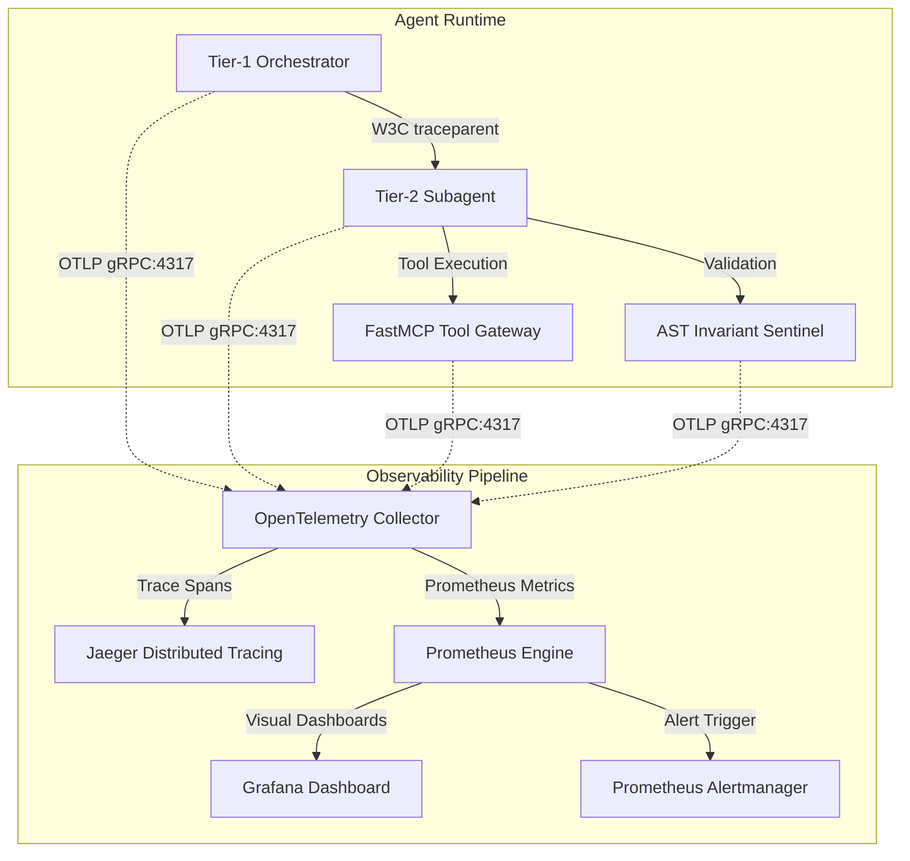

# Agentic Observability & Telemetry Mesh

OpenTelemetry, Prometheus, and Grafana configurations engineered specifically for multi-turn AI coding agents, subagent hierarchies, and architectural quality gates.

---

## Architecture Overview

Traditional application monitoring focuses on HTTP request rates and database query latencies. AI coding agents introduce non-deterministic, multi-scale failure modes that require a specialized telemetry mesh:



---

## Semantic Attribute Conventions for GenAI Agents

All agent traces should emit standardized semantic attributes compliant with the evolving OpenTelemetry GenAI standards and `vibes` extensions:

| Attribute Key | Type | Description | Example |
|---|---|---|---|
| `gen_ai.system` | `string` | The underlying inference provider | `anthropic`, `ollama`, `openai` |
| `gen_ai.request.model` | `string` | Target model identifier | `claude-3-7-sonnet-latest`, `qwen2.5-coder:32b` |
| `gen_ai.usage.prompt_tokens` | `int` | Inbound context tokens | `4820` |
| `gen_ai.usage.completion_tokens` | `int` | Output generated tokens | `640` |
| `agent.persona` | `string` | Operational role for this execution step | `architect`, `coder`, `sentinel`, `reviewer` |
| `agent.slot_id` | `string` | Unique identifier of active worker slot | `subagent-worker-02` |
| `agent.invariant.checked` | `boolean` | Whether AST complexity gates were evaluated | `true` |
| `agent.invariant.status` | `string` | Quality gate result | `passed`, `violation` |
| `agent.cegis.round` | `int` | Counterexample synthesis iteration index | `3` |

---

## Included Resources

1. [**`otel-collector-config.yaml`**](./otel-collector-config.yaml):
   - Ingests OTLP spans and metrics over gRPC (`4317`) and HTTP (`4318`).
   - Memory limiter protection (`75%` limit with `20%` spike buffer).
   - Injects default environment attributes and scrubs potential secrets.
   - Dual export to Jaeger (`jaeger:4317`) and Prometheus (`:8889`).

2. [**`prometheus-agent-alerts.yaml`**](./prometheus-agent-alerts.yaml):
   - `AgentTokenBurnSpike`: Triggers when token velocity exceeds 50k tokens/min.
   - `AgentASTInvariantBreachRate`: Alerts when >25% of synthesis attempts fail complexity caps.
   - `AgentCEGISConvergenceStall`: Alerts if counterexample search exceeds 8 rounds.
   - `AgentAPIQuotaNearExhaustion`: Warns when client-side token bucket falls below 100 requests.
   - `AgentEgressViolationAttempt`: Pager alert if sandbox egress detects blocked SSRF attempts.

3. [**`grafana/agent-telemetry-dashboard.json`**](./grafana/agent-telemetry-dashboard.json):
   - Turnkey Grafana dashboard visualization tracking token spend velocity, P50/P90/P99 tool execution latencies, AST gate pass/fail ratios, CEGIS convergence distributions, and Valkey L2 cache hit rates.

---

## Quickstart (Local Evaluation)

Launch the full observability mesh via Docker Compose:

```bash
cd resources/docker-compose
docker compose up -d
```

- Jaeger UI: [http://localhost:16686](http://localhost:16686)
- Prometheus Engine: [http://localhost:9090](http://localhost:9090)
- Grafana Dashboard: [http://localhost:3000](http://localhost:3000) (user `admin`; password from `GF_SECURITY_ADMIN_PASSWORD` in your `.env`, which has no default)
